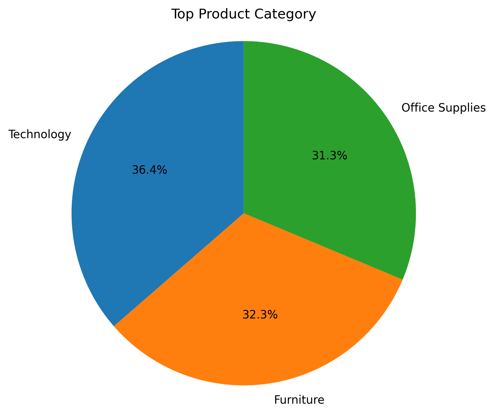
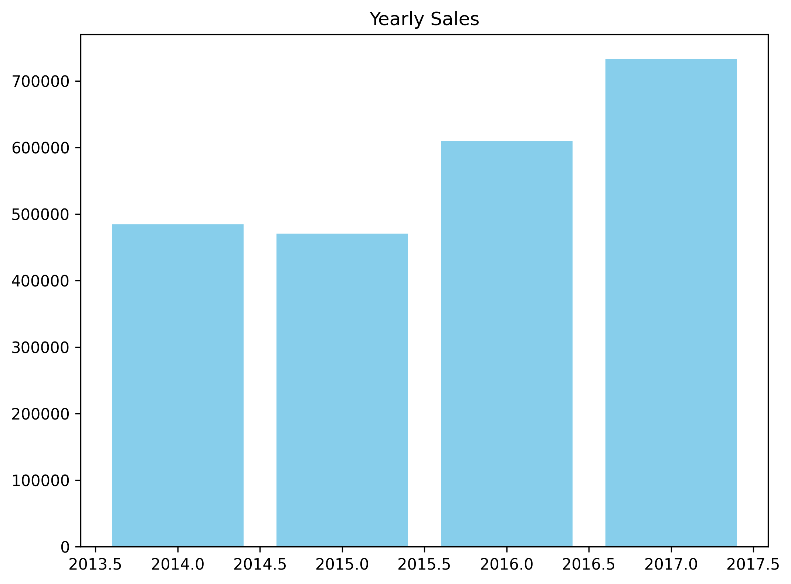

# Superstore Sales Data Analysis

## Project Overview

This project analyzes Superstore transactional sales data to uncover insights into **customer behavior, product performance, geographic trends, and time-based sales patterns**. The goal is to transform raw sales data into actionable insights that support strategic decision-making across marketing, operations, and inventory planning.

The dataset contains **9,994 records and 21 features**, including customer segments, product categories, sales, profit, shipping modes, and order dates.

---

## Key Visualizations & Insights

### Customer Segmentation

* The **Consumer segment** represents the largest share of customers and generates the highest total sales.
* Corporate and Home Office segments contribute meaningfully but at lower volumes.

**Insight:** Individual consumers are the primary revenue drivers.

---

### Sales by Customer Segment

* Consumer customers contribute the majority of revenue, followed by Corporate and Home Office segments.

**Insight:** Marketing and retention strategies should prioritize the Consumer segment.

---

### Repeat Customers & Top Spenders

* A small group of customers places frequent orders and contributes disproportionately to total revenue.
* High-value customers exhibit strong repeat purchase behavior.

**Insight:** These customers represent high Customer Lifetime Value (CLTV).

---

### Shipping Mode Preference

* **Standard Class shipping** is used most frequently, far exceeding faster shipping options.

**Insight:** Customers prioritize cost efficiency over speed, presenting opportunities for logistics cost optimization.

---

### Geographic Distribution (State & City Level)

* **California, New York, and Texas** have the highest customer counts.
* **New York City and Los Angeles** lead in city-level sales performance.

**Insight:** Revenue is concentrated in major metropolitan and coastal regions.

---

### Sales by State

* California and New York generate the highest total sales.
* Sales performance varies significantly by state.

**Insight:** Regional strategies can be optimized by focusing on high-performing states.

---

### Product Category Performance

* **Technology** is the top-performing category, followed by Furniture and Office Supplies.
* **Phones and Chairs** are the highest-grossing sub-categories.

**Insight:** High-performing products should be prioritized for inventory and promotion.

---

### Time Series Analysis

* Year-over-year sales show consistent growth from 2014 to 2017.
* Sales peak in **Q4**, with the highest monthly sales occurring in **November and December**.

**Insight:** Strong seasonality exists, especially toward year-end.

---

### Sales Distribution Visualizations

* **Sunburst and treemap charts** reveal how revenue is distributed across categories, sub-categories, and shipping modes.
* These visualizations highlight product and logistics combinations that generate the most value.

**Insight:** Technology products shipped via Standard Class account for the majority of sales contribution.

---

## Key Results

* Consumer customers drive the majority of revenue.
* Technology products, especially Phones, are the strongest performers.
* Sales are heavily concentrated in California, New York, and major cities.
* Standard Class shipping dominates usage.
* Clear seasonal trends with peak sales in Q4.
* A small set of customers contributes a large share of total sales.

---

## Business Recommendations

* **Focus marketing efforts on Consumer customers** to maximize ROI.
* **Expand and promote high-performing Technology products**, particularly Phones.
* **Strengthen operations in top-performing states** while exploring growth in emerging regions.
* **Plan inventory and campaigns ahead of Q4** to capture seasonal demand.
* **Implement customer retention strategies** for repeat and high-spending customers.
* **Maintain cost-efficient shipping strategies** centered on Standard Class delivery.

---

## Tools & Technologies

* Python (Pandas, NumPy)
* Data Visualization: Matplotlib, Seaborn, Plotly
* Jupyter Notebook
* Exploratory Data Analysis (EDA)
* Time Series Analysis

---

## Outcome

This analysis provides a clear, data-driven understanding of Superstore’s sales performance and offers actionable insights to support growth strategy, customer retention, and operational optimization.
